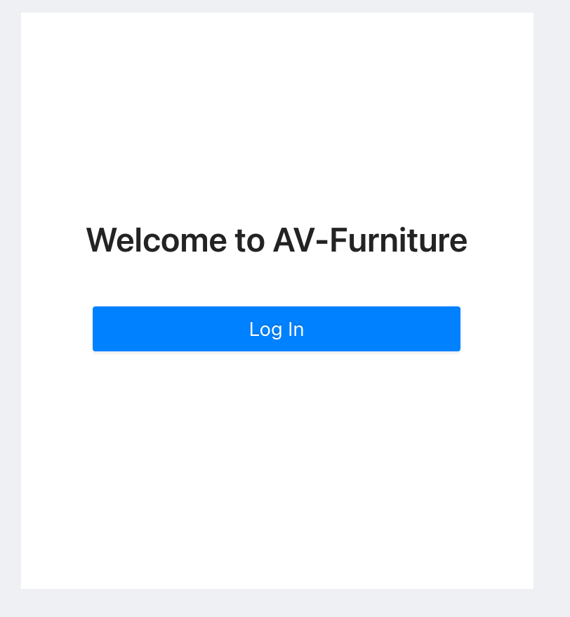
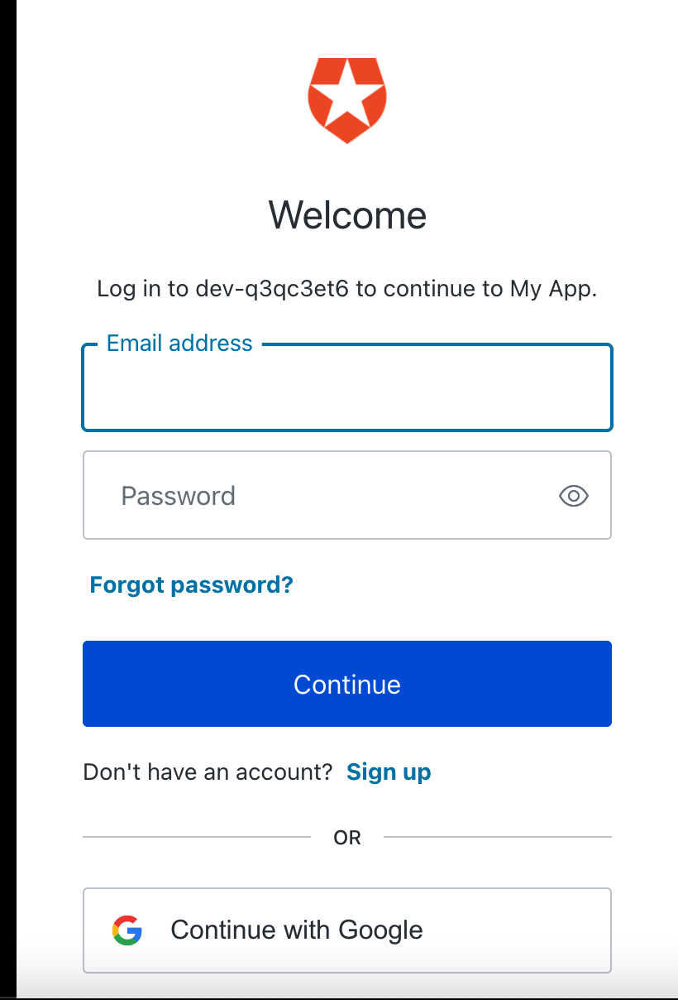
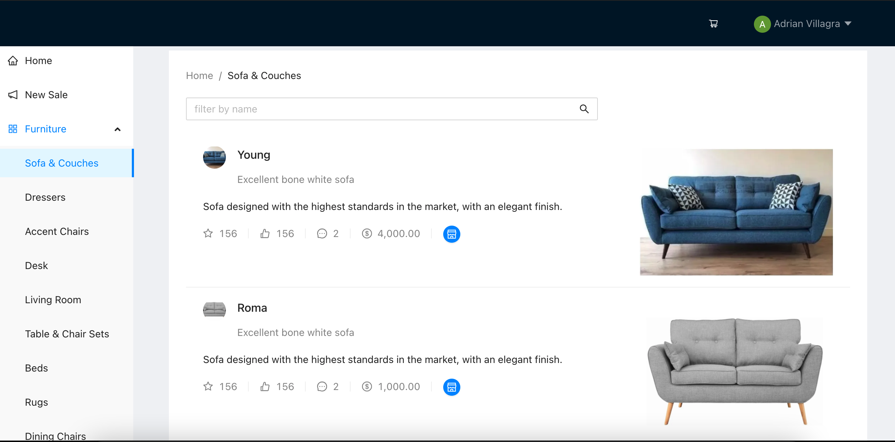
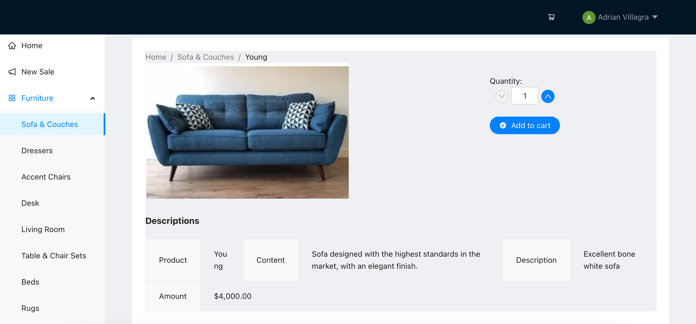
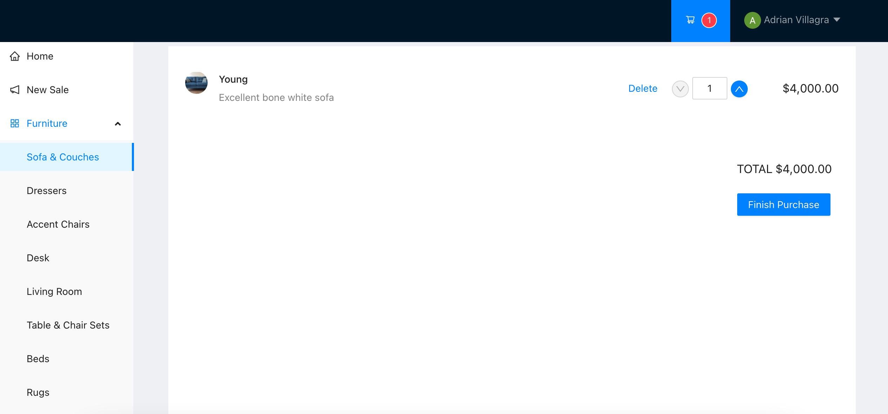
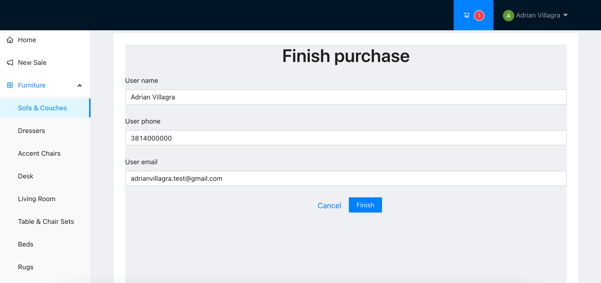
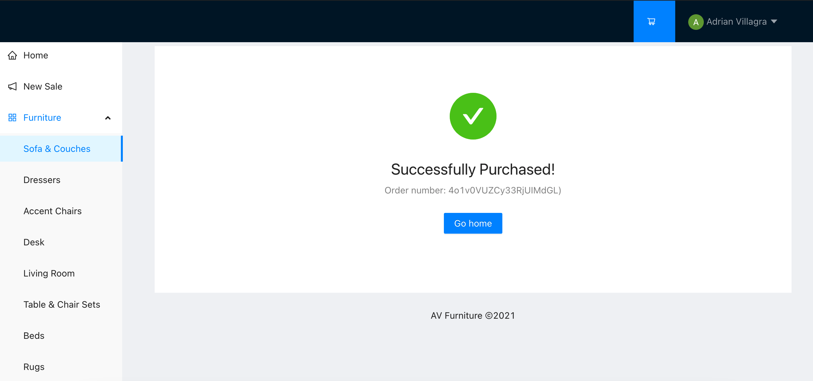
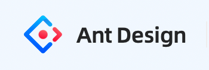

# AV-Furniture

AV-Furniture is a web application, based on an eCommerce for the sale of furniture.

## Installation

Use the package manager [yarn](https://yarnpkg.com/getting-started/install) to install AV-Furniture.

```bash
yarn install
```

## Usage
Login
#

#
Auth0
#

#
List of furniture
#

#Detail
#

#
Cart
#

#
Finish purchase
#

#
Succesfully purchased
#



<h3 align="left">Languages and Tools Used:</h3>
<p align="left"> <a href="https://dotnet.microsoft.com/" target="_blank">  </a> <a href="https://git-scm.com/" target="_blank">  </a> <a href="https://developer.mozilla.org/en-US/docs/Web/JavaScript" target="_blank">  </a> <a href="https://reactjs.org/" target="_blank">  </a> <a href="https://www.typescriptlang.org/" target="_blank">  </a>  <a href="https://ant.design/" target="_blank">  </a> </p>

## License
[MIT](https://choosealicense.com/licenses/mit/)

